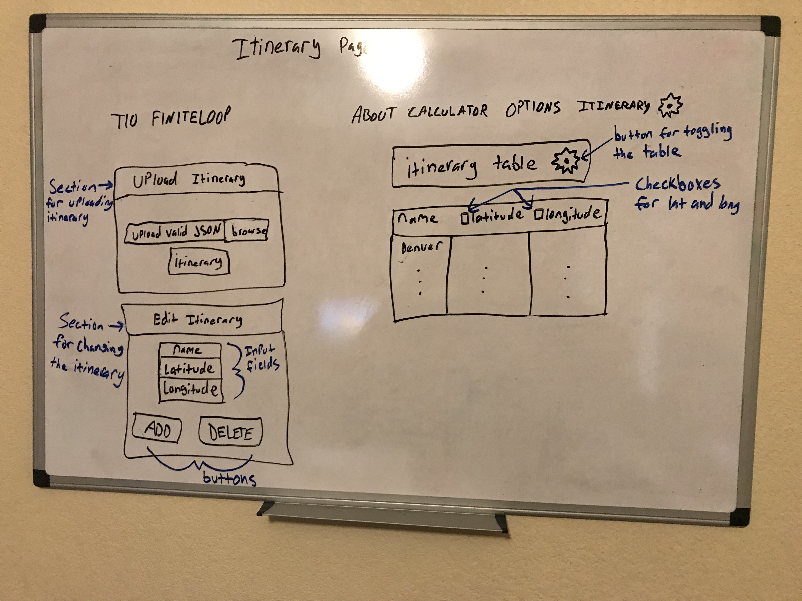
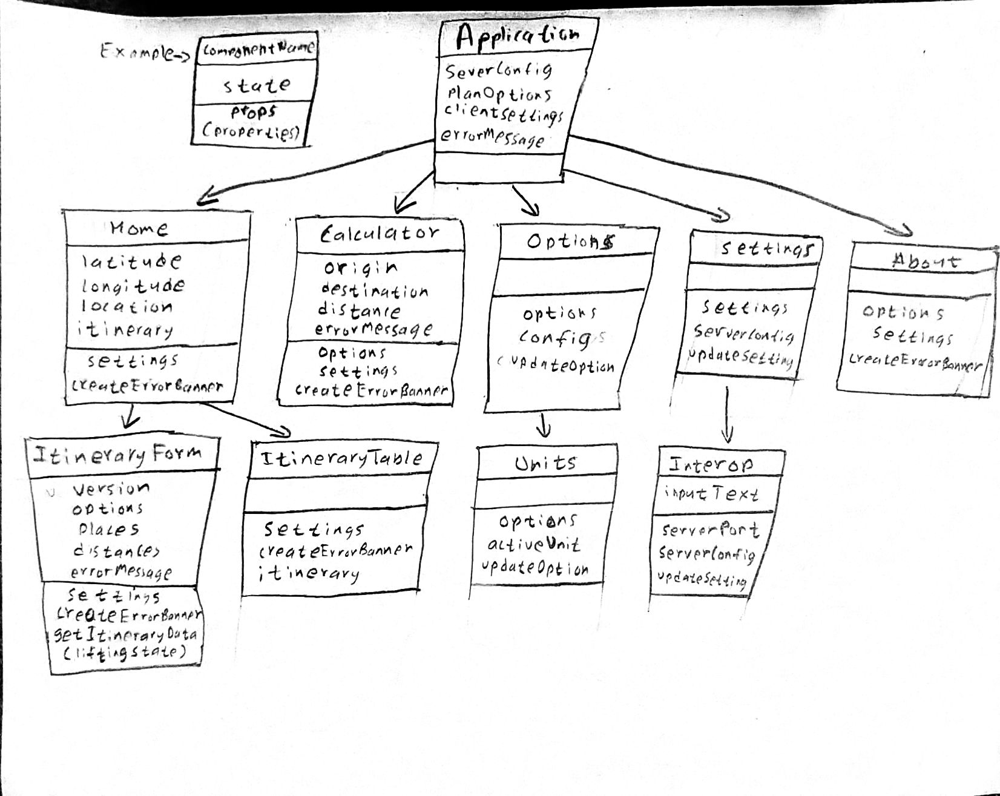

# Sprint 3 - *T10* - *finiteLoop*

## Goal

### Shorter trips to more places!
### Sprint Leader: *Jonathan Perea*

## Definition of Done

* Version in pom.xml should be `<version>3.0.0</version>` for your final build for deployment.
* Increment release `v3.0` created on GitHub with appropriate version number and name.
* Increment `server-3.0.jar` deployed for testing and demonstration on SPRINT3 assignment.
* Sprint Review, Restrospective, and Metrics completed (team/sprint3.md).

## Policies

#### Mobile First Design!
* Design for mobile, tablet, laptop, desktop (in that order).
* Use ReactStrap for a consistent interface (no HTML, CSS, style, etc.).
* Must adhere to the TripCo Interchange Protocol (TIP) for interoperability and testing.
#### Clean Code
* Code Climate maintainability of A or B.
* Code adheres to Google style guides for Java and JavaScript.
#### Test Driven Development
* Write method headers, unit tests, and code in that order.
* Unit tests are fully automated.
* Code Coverage above 40%
#### Configuration Management
* Always check for new changes in master to resolve merge conflicts locally before committing them.
* All changes are built and tested before they are committed.
* All commits include a task/issue number.
* All commits include tests for the added or modified code.
* All tests pass.
#### Continuous Integration / Delivery 
* Master is never broken.  If broken, it is fixed immediately.
* Continuous integration successfully builds and tests all pull requests for master branch.
* All Java dependencies in pom.xml.  Do not load external libraries in your repo. 

## Plan

This sprint will complete the following Epics.

* *#32 User: I may need distances in other units of measure*

        * Let the user configure other units of measure for distance from the user interface.
    
* *#100 User: Show me a map and itinerary for my trip*
    
        * My itinerary is in a file created by a tool. The file format is described somewhere (tip.md).
        * I should be able to load the itinerary from a file.
        * I'd like to see the leg and cumulative distances at each stage in the itinerary.
        * I'd like to see an interactive map showing my entire trip on the screen.
        * I'd like to be able to choose what to display for each destination in the itinerary.
        * I'd like to save the itinerary with the leg distances to a file for future reference or use in another tool. - The new file should maintain the original values for the latitude and longitude.
    
* *#89 User: It would be nice to see a map with the calculator.*

        * Add markers for origin and destination
        * Validate input
        
* *#162 User: Make my trip shorter*

        * Allow an optional optimization.
        * Use the nearest neighbor algorithm to shorten the trip.
        
* *#166 User: Data shouldn't go away when I change tabs.*

        * it's not just the calculator anymore.

        

#### Discussion for Plan

We planned on doing 5 epics this sprint. For epic #32, we need to add the option
to allow the user to pick the units they wish to use. For epic #100, we plan to
finish adding options to the table and adding a save button to save
the file. In #89, we plan to add the markers for origin and destination
and validate the user input before adding a marker to the map. We plan to do
the epics #162, #166.

We are going to create a new page for uploading, editing and displaying itineraries:

(Diagram of Server Hierarchy)

###### *Diagram of Client Hierarchy*
## Metrics

| Statistic | # Planned | # Completed |
| --- | ---: | ---: |
| Epics | *6* | *2* |
| Tasks |  *13*   | *37* | 
| Story Points |  *14*  | *29* | 

## Scrums

| Date | Tasks closed  | Tasks in progress | Impediments |
| :--- | :--- | :--- | :--- |
| *date* | *#task, ...* | *#task, ...* | *none* | 
| *3/6* | *#182, #180, #179* | *#167, #171, #105, #112, #104, #32, #89* | *none* |
| *3/7* | *#185, #188, #189, #187* | *#182, #171, #105, #112, #114, #32, #89* | *none* |
| *3/8* | *#192* | *#190, #105, #112, #104, #167, #171, #32, #89* | *none* |
| *3/9* | *#194* | *#190, #105, #112, #104, #167, #171, #108, #32, #89* | *none* |
| *3/10* | *#190, #167, #108, #112, #197* | *#105, #104, #171, #32, #89* | *none* |
| *3/12* | *#201* | *#105, #10, #171, #176, #199, #32, #89, #100* | *none* |
| *3/13* | *#199, #204, #171, #32, #89* | *#105, #104, #200, #203, #100* | *none* |
| *3/14* | *#105* | *#104, #200, #100* | *none* |
| *3/15* | *#203* | *#104, #200, #100* | *none* |
| *3/18* | *#207* | *#104, #200, #100* | *none* |
| *3/22* | *#208, #210, #100* | *#104, #200* | *none* |
| *3/25* | *#200* | *#104, #100, #166, #217, #195* | *none* |
| *3/26* | *#212* | *#104, #100, #166, #217, #195* | *none* |
| *3/27* | *#174, #177, #214* | *#104, #100, #166, #217, #195* | *none* |
| *3/28* | *#163, #175, #195, #215, #216, #104, #218, #195* | *#100, #166, #217* | *none* |

## Review (focus on solution and technology)

In this sprint, we built the api/find, added functionality to our Itinerary page, used Cookies to store
information on pages, added functionality to our map on the Calculator page, and added in some error checking
to the Calculator page for input.

#### Completed epics in Sprint Backlog 

These Epics were completed.

* *## epic title: comments*
* *#89 User: It would be nice to see a map with the calculator. : Map now functions with Markers that update on render.*
* *#32 User: I may need distances in other units of measure Epic. : Custom units can be made by typing in a value
and a desired name. Units are saved through website by using Cookies.*

#### Incomplete epics in Sprint Backlog 

These Epics were not completed.

* *## epic title: explanation*
* *#217 User: Let me change my itinerary. : We got most of the tasks done for this epic, but did not finish changing the
order or choosing a new starting location. We put those aside because of lack of time and not getting optimizations working.*
* *#100 User: Show me a map and itinerary for my trip. : We finished this epic last sprint except for the choosing what to display.
 We didn't think this was a top priority, so it got pushed back.*
* *#166 User: Data shouldn't go away when I change tabs. : We got Cookies working on all pages except for our itinerary page.
The itinerary page was causing some issues in implementing cookies because of the set up, and we ran out of time to finish.*
* *#162 User: Make my trip shorter. : We were unable to do this epic due to complexity.*

#### What went well

The project overall went well. We fixed our issues for the server side code. We were able to add in more functionality to 
most of our pages client side. Our code coverage improved significantly by adding in many test cases.

#### Problems encountered and resolutions

The problems we ran into were mainly with testing and server issues. The client side testing confused us for awhile, but
we were able to figure out how to write tests by studying the other test cases and reading documentation. Our server had
a lot of issues where we kept receiving error codes for requests. We resolved this by going back through our code and 
frequently testing using IntelliJ's RESTful API testing and Postman to check requests and sending various kinds of requests 
with different kinds of information to check all the results were good.

## Retrospective (focus on people, process, tools)

In this sprint, ...

#### What we changed this sprint

Our changes for this sprint ...

#### What we did well

We started working as a team better instead of lone wolfing it. We planned very effectively this sprint.  

#### What we need to work on

We could improve time mangement. Not underestimating epics will help us signicantly as we were not able to finish one of the priority epics. 

#### What we will change next sprint 

We will change how long we expect each epic to take as the difficulty for each one varies. We will assume the priority ones will be the most challenging and plan accordingly.
