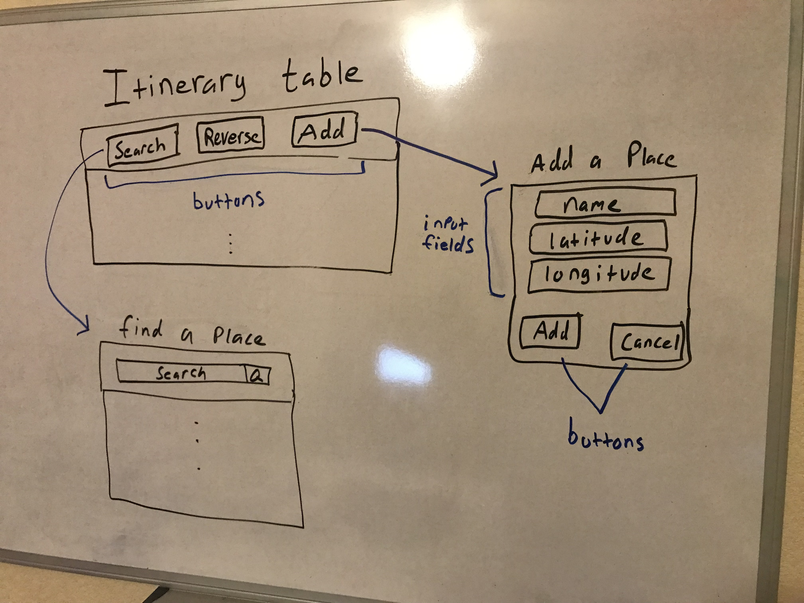

# Sprint 4 - *T10* - *FiniteLoop*

## Goal

### Worldwide!
### Sprint Leader: *Saurav Bhuju*

## Definition of Done

* Version in pom.xml should be `<version>4.0.0</version>` for your final build for deployment.
* Increment release `v4.0` created on GitHub with appropriate version number and name.
* Increment `server-3.5.jar` deployed for testing and demonstration on CHECK4 assignment.
* Increment `server-4.0.jar` deployed for testing and demonstration on SPRINT4 assignment.
* Sprint Review, Restrospective, and Metrics completed (team/sprint4.md).

## Policies

#### Mobile First Design!
* Design for mobile, tablet, laptop, desktop (in that order).
* Use ReactStrap for a consistent interface (no HTML, CSS, style, etc.).
* Must adhere to the TripCo Interchange Protocol (TIP) for interoperability and testing.
#### Clean Code
* Code Climate maintainability of A or B.
* Code adheres to Google style guides for Java and JavaScript.
#### Test Driven Development
* Write method headers, unit tests, and code in that order.
* Unit tests are fully automated.
* Code Coverage above 50%
#### Configuration Management
* Always check for new changes in master to resolve merge conflicts locally before committing them.
* All changes are built and tested before they are committed.
* All commits include a task/issue number.
* All commits include tests for the added or modified code.
* All tests pass.
#### Continuous Integration / Delivery
* Master is never broken.  If broken, it is fixed immediately.
* Continuous integration successfully builds and tests all pull requests for master branch.
* All Java dependencies in pom.xml.  Do not load external libraries in your repo.

## Plan

This sprint will complete the following Epics.

* *#0 epic title: description*
* *#162 User: Make my trip shorter: Implement Nearest Neighbor algorithm*
* *#166 User: Data shouldn't go away when I change tabs.: Finish using cookies for Itinerary tab*
* *#235 TripCo: validate all requests sent to the server and responses received by the client: Use schemas to validate json*
* *#217 User: Let me change my itinerary: Add buttons to move itinerary around*
* *#100 User: Show me a map and itinerary for my trip: Choose what to display on table*
* *#234 User: I want to view my trip in other tools.: Write itinerary in CSV and map in KML or SVG*
* *#232 User: Let me plan trips world wide.: Pull data from other world, region, and country information.*

***(Include a discussion of you plan with key diagrams here and remove this!)***
This sprint we will finish four epics from the previous sprints and three from the new sprint. The four from the previous
sprint are the epics #162, #166, #217, #100. The new epics are #235, #234, and #232. The epics from sprint 3
will edit the client side itinerary table by moving data around and also implementing the short optimization.
The new sprints will validate input, pull data from more sources, and allow for the user to have a more 
friendly UI. 

(Diagram of Server Hierarchy)

New layout for our itinerary table:

###### *Diagram of Client Hierarchy*

## Metrics

| Statistic | # Planned | # Completed |
| --- | ---: | ---: |
| Epics | *7* | *value* |
| Tasks |  *6*   | *value* |
| Story Points |  *8*  | *value* |

## Scrums

| Date | Tasks closed  | Tasks in progress | Impediments |
| :--- | :--- | :--- | :--- |
| *date* | *#task, ...* | *#task, ...* | *none* |

## Review (focus on solution and technology)

In this sprint, ...

#### Completed epics in Sprint Backlog

These Epics were completed.

* *## epic title: comments*
*

#### Incomplete epics in Sprint Backlog

These Epics were not completed.

* *## epic title: explanation*
*

#### What went well

The ...

#### Problems encountered and resolutions

The ...

## Retrospective (focus on people, process, tools)

In this sprint, ...

#### What we changed this sprint

Our changes for this sprint included ...

#### What we did well

We ...

#### What we need to work on

We could improve ...

#### What we will change next sprint

We will change ...
