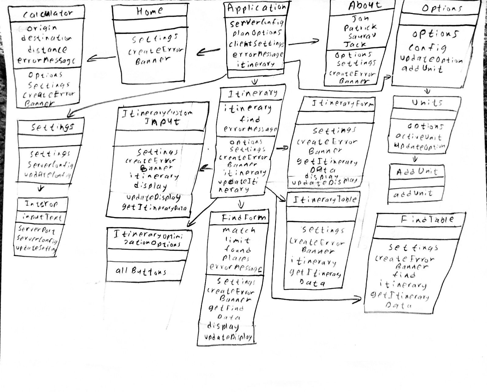

# Sprint 5 - *10* - *finiteLoop*

## Goal

### A Beautiful User Experience!
### Sprint Leader: *Jack Fitzgerald*

## Definition of Done

* Version in pom.xml should be `<version>5.0.0</version>` for your final build for deployment.
* Increment release `v5.0` created on GitHub with appropriate version number and name.
* Increment `server-5.0.jar` deployed for testing and demonstration on SPRINT5 assignment.
* Sprint Review, Retrospective and Metrics completed (team/sprint5.md).

## Policies

#### Mobile First Design!
* Design for mobile, tablet, laptop, desktop (in that order).
* Use ReactStrap for a consistent interface (no HTML, CSS, style, etc.).
* Must adhere to the TripCo Interchange Protocol (TIP) for interoperability and testing.
#### Clean Code
* Code Climate maintainability of A or B.
* Code adheres to Google style guides for Java and JavaScript.
#### Test Driven Development
* Write method headers, unit tests, and code in that order.
* Unit tests are fully automated.
* Code Coverage above 50%
#### Configuration Management
* Always check for new changes in master to resolve merge conflicts locally before committing them.
* All changes are built and tested before they are committed.
* All commits include a task/issue number.
* All commits include tests for the added or modified code.
* All tests pass.
#### Continuous Integration / Delivery 
* Master is never broken.  If broken, it is fixed immediately.
* Continuous integration successfully builds and tests all pull requests for master branch.
* All Java dependencies in pom.xml.  Do not load external libraries in your repo. 
* Each team member must complete Interop with another team and file an issue in the **class** repo with the results.
  * title is your team number and your name, 
  * labels should include Interop and the Team that you tested with, 
  * description should include a list of tests performed, noting any failures that occurred.

## Plan

This sprint will complete the following Epics.

* *#84 User: let me choose from different map backgrounds.* 
* *#310 User: I want to view my trip in other tools.* 
* *#305 User: Give me a friendly message if something goes wrong.*  
* *#304 User: I would like to highlight certain places on the map* 
* *#235 TripCo: validate all requests sent to the server and responses received by the client*  
* *#303 User: Can trips be shorter?* 
* *#311 User: Let me plan trips world wide.* 

* In this sprint we plan on completing 2-opt and finishing up epics from sprint 4

(Diagram of Server Hierarchy)

###### *Diagram of Client Hierarchy*

## Metrics

| Statistic | # Planned | # Completed |
| --- | ---: | ---: |
| Epics | *7* | *value* |
| Tasks |  *20*   | *value* | 
| Story Points |  *12*  | *value* | 

## Scrums

| Date | Tasks closed  | Tasks in progress | Impediments |
| :--- | :--- | :--- | :--- |
| *date* | *#task, ...* | *#task, ...* | *none* | 

## Review (focus on solution and technology)

In this sprint, ...

#### Completed epics in Sprint Backlog 

These Epics were completed.

* *## epic title: comments*
* 

#### Incomplete epics in Sprint Backlog 

These Epics were not completed.

* *## epic title: explanation*
* *#310 I want to view my trips in other tools: Turned out to be much more complicated than we originally thought it would be.* 

#### What went well

We were able to better optimize and test our existing code.

#### Problems encountered and resolutions

The ...

## Retrospective (focus on people, process, tools)

In this sprint, ...

#### What we changed this sprint

Our changes for this sprint included ...

#### What we did well

We ...

#### What we need to work on

We could improve ...

#### What we will change next sprint 

We will change ...